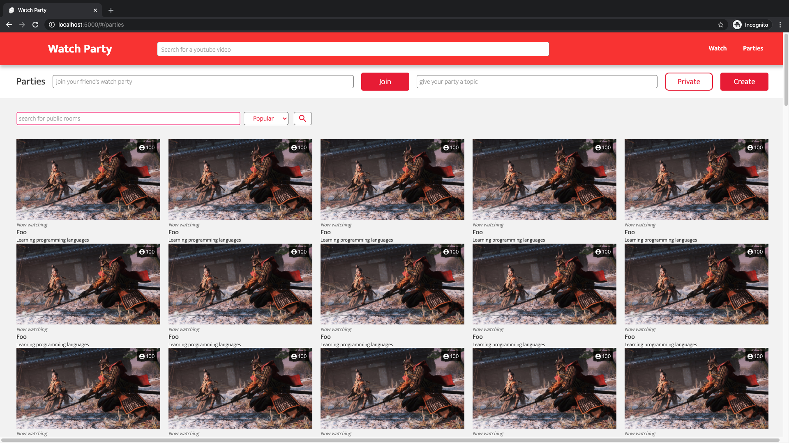
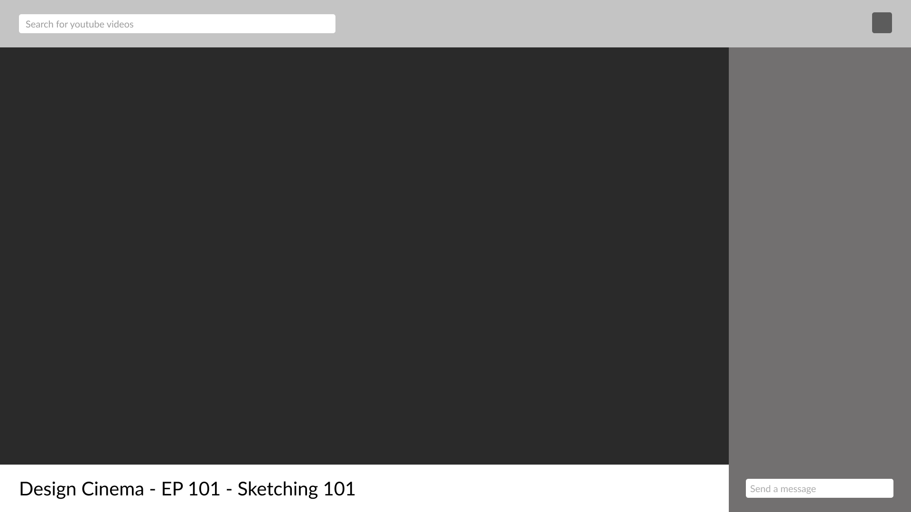

<br />
<p align="center">
  <h3 align="center">Watch Party</h3>

  <p align="center">
    A web design project for a shared YouTube experience
    <br />
    <a href="https://github.com/sinplea/watch-party"><strong>Explore the docs »</strong></a>
    <br />
    <br />
    <a href="https://github.com/sinplea/watch-party/issues">Report Bug</a>
    ·
    <a href="https://github.com/sinplea/watch-party/issues">Request Feature</a>
  </p>
</p>

<!-- TABLE OF CONTENTS -->
## Table of Contents

- [Table of Contents](#table-of-contents)
- [About The Project](#about-the-project)
  - [Tech Stack](#tech-stack)
    - [Frontend](#frontend)
    - [Backend](#backend)
  - [Early Designs](#early-designs)
- [Development Setup](#development-setup)
- [Usage](#usage)
- [Roadmap](#roadmap)
- [License](#license)
- [Contact](#contact)

<!-- ABOUT THE PROJECT -->
## About The Project

|  |
|:--:| 
| *A recent screenshot of the site (with mock data)* |

Watch Party is a web design project that will let people watch YouTube and interact together. 

> *Currently, this project is a playground to experiment with new modern frontend & backend technologies and to expand my understanding of modern web development. Watch Party has not yet been deployed to a live server but can still be played with in a development environment.*

### Tech Stack

#### Frontend

* [Svelte](https://github.com/sveltejs/svelte) | Front-end Framework
* [Typescript](https://github.com/microsoft/TypeScript) | Type Checking & Scale
* [Jest](https://github.com/facebook/jest) & [testing-library](https://github.com/testing-library) | Unit & Integration Testing
* [Websockets](https://developer.mozilla.org/en-US/docs/Web/API/WebSockets_API) | Real Time Data Transfer Between Clients

#### Backend

[Luna](https://github.com/sinplea/luna) | Custom Service (See repo for details).

### Early Designs

Design is taking a front seat in this project. Designs are created in [Figma](https://figma.com) and translated into [Svelte](https://github.com/sveltejs/svelte) code as the project progresses.

|  | 
|:--:| 
| *The earliest low fidelity mockup* |

Design screenshots can be found in [screenshots/design](screenshots/design).

<!-- GETTING STARTED -->
## Development Setup

1. **npm** is required.
```sh
npm install npm@latest -g
```
2. Clone the repo.
```sh
git clone https://github.com/sinplea/watch-party.git
```
3. Install npm dependencies.
```sh
cd watch-party
npm install
```
4. Get a **YouTube API key**. Follow these ([instructions](https://developers.google.com/youtube/v3/getting-started)).

5. Create a .env file.
```sh
touch .env
echo 'API_KEY=YOUR_KEY_HERE' >> .env
echo 'LUNA_DEV_SERVER=https://localhost:8080' >> .env
```

> *(**IMPORTANT:** This .env file exposes sensitive data on the client. API keys should be requested on the [custom backend server](https://github.com/sinplea/luna), but I haven't had the time to implement this yet. This feature will be done before live server deployment).*

## Usage

1. Run the dev server
```sh
npm run dev
# site is now live on localhost:5000
```

2. (Optional) Run tests
```sh
npm run test
```
*See packgage.json for extra commands.*

<!-- ROADMAP -->
## Roadmap


In general, the goals of this project are to get take the concept of watching youtube with your friends, an idea that has been explored on a number of times on other sites, and enhance the experience with good UX, frontend skills, and creative backend solutions.

Development progress can be seen on [Trello](https://trello.com/b/2cXKIJ0l/watch-party).

<!-- LICENSE -->
## License

Distributed under the MIT License. See `LICENSE` for more information.

<!-- CONTACT -->
## Contact

Alex Werner - [@sinplea_](https://twitter.com/@sinplea_) - alexanderdwerner@gmail.com

<!-- MARKDOWN LINKS & IMAGES -->
<!-- https://www.markdownguide.org/basic-syntax/#reference-style-links -->
[stars-shield]: https://img.shields.io/github/stars/sinplea/repo.svg?style=flat-square